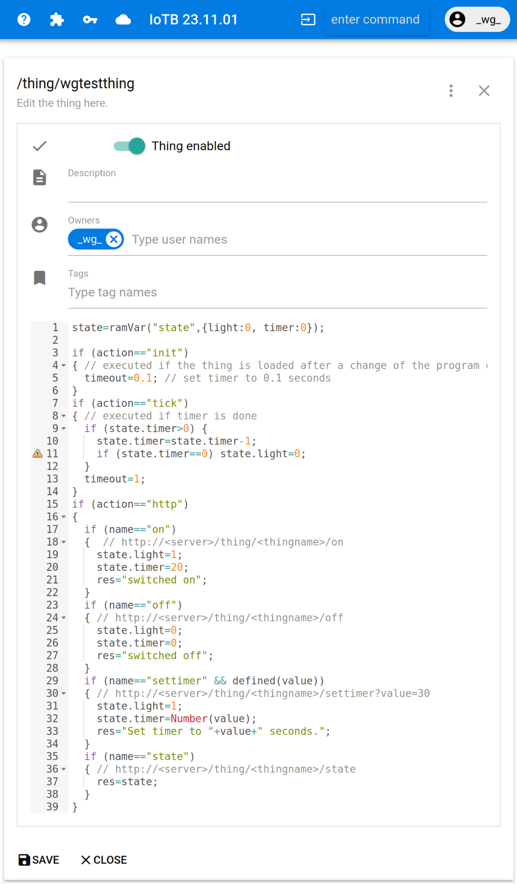

# IoTB - IoT-Broker node module
created by DI Klaus Weichinger  snaky.1@gmx.at  

License: [GPLv3](./LICENSE)

Change-Log: [./doc/changelog.md](./doc/changelog.md)

The IoT-Broker is a server with following functionality (__short list__):

- Execution of microservices and web-based IDE to develop them
- Manage API-keys (tokens)
- Host webpages
- User-Management

__Detailed list:__

- __Executes microservices__ (in the following called things), which can be executed via HTTP requests, Web-Sockets, other things and with timers. A thing could have non volative variables which could store information from one call to an other. In addition, this could be stored and reloaded from a database.
The following example thing provides a HTTP API to switch on/off a light, to get the state of the light and an automatic timer to switch them off after 20 seconds.
This script can be edited with the embedded web-based IDE. Also see the [detailed description of the script language here](./doc/scripting.md) and a summary of [examples](./doc/scripting-examples.md). The custom developed language avoids infinite loops or blocking programms.


```javascript
// Example Thing Script for a light
state=ramVar("state",{light:0, timer:0});

if (action=="init")
{ // executed if the thing is loaded after a change of the program or a server restart
  timeout=0.1; // set timer to 0.1 seconds
}
if (action=="tick")
{ // executed if timer is done
  if (state.timer>0) {
    state.timer=state.timer-1;
    if (state.timer==0) state.light=0;
  }
  timeout=1;
}
if (action=="http")
{
  if (name=="on")
  {  // http://<server>/thing/<thingname>/on
    state.light=1;
    state.timer=20;
    res="switched on";
  }
  if (name=="off")
  { // http://<server>/thing/<thingname>/off
    state.light=0;
    state.timer=0;
    res="switched off";
  }
  if (name=="settimer" && defined(value))
  { // http://<server>/thing/<thingname>/settimer?value=30
    state.light=1;
    state.timer=Number(value);
    res="Set timer to "+value+" seconds.";
  }
  if (name=="state")
  { // http://<server>/thing/<thingname>/state
    res=state;
  }
}
```

- Management of keys which are used to improve the control of HTTP API access
- Host multiple web-pages to speedup Web-App development.
- Multiuser management for thing, key and web-pages development.
## Installation
Setup a new IoT-Broker with following steps:

- sqlite3 is required. Maybe following lines have to be executed.

      sudo apt-get install libsqlite3-dev
      apt-get install sqlite3

- create a new directory e.g. `./iotbroker`

      mkdir iotbroker

- change to this directory

      cd ./iotbroker

- create a subdirectory `./db`

      mkdir db

- install the required iotb node-package from github with

      npm install github:weingaunity/iotb

- For web-pushnotifications a public and private key have to be generated with the command line tool [web-push](https://www.npmjs.com/package/web-push).

      sudo npm install -g web-push
      web-push generate-vapid-keys --json > webpushkeys.json

- copy the `servertemplate.js` to the local directory

      cp ./node_modules/iotb/templates/servertemplate.js ./server.js

- within the directory `./iotbroker` there is now the `server.js` with following content and change the settings marked with `//edit`.

```javascript
    var iotb = require('iotb');
    var webpushkeys=require('./webpushkeys.json');

    var iotbapp=iotb({
      port:8081, // optional edit
      publichost:"localhost:8081", // edit, required e.g. to build links in emails; e.g. iotbroker.xyz
      systemadministrator:"iotadmin - <yourmail>", //edit
      defaultadmin:{
        user: "iotadmin",                     // edit
        username: "IoT Broker Administrator", // edit
        password: "<yourpwd>",                // edit
        email: "<yourmail>"                   // edit
      },
      dbfile:"./db/iot.db",       
      webpush:{
        // copy content from keys.txt generated by web-push
        publickey: webpushkeys.publicKey,
        privatekey: webpushkeys.privateKey,
        email: "<yourmail>" // edit
      },
    /*  
      email:{
        type:"microsoft",
        username:"<yourmail>", // edit
        password:"<password>", // edit
        scopes: [
            //"https://outlook.office.com/IMAP.AccessAsUser.All",
            //"https://outlook.office.com/POP.AccessAsUser.All",
            "https://outlook.office.com/SMTP.Send"
            //"offline_access"
        ],
        auth: {
            clientId: 'xxxxxxxx-xxxx-xxxx-xxxx-xxxxxxxxxxxx', // edit
            authority: 'https://login.microsoftonline.com/yyyyyyyy-yyyy-yyyy-yyyy-yyyyyyyyyyyy/v2.0', // edit
        }
      },  
    */  
      limits:{  // default settings, can be changed
        zipfileupload_mb:5,
        websitetotalsize_mb:10
      }
    });

    var app=iotbapp.express;

    iotbapp.run().then(()=>{
      console.log("IoT Broker listening on port "+iotbapp.config.port);
      let events = [
        {name: 'beforeExit', exitCode: 0 },
        {name: 'uncaughtExecption', exitCode: 1 },
        {name: 'SIGINT', exitCode: 130 },
        {name: 'SIGTERM', exitCode: 143 }
      ];

      events.forEach((e) => {
        process.on(e.name,  () => {
        iotbapp.stop()
          .then(() => { 
            console.log('connection cleaned');
            process.exit(e.exitCode);
          })
          .catch((err) => {
            console.error(err);
            process.exit(1);
          })    
        })
      });
    }).catch((e)=>{
      console.log("Error loading IoT Broker");
    });
```

## Run

Run the broker with following line

    node ./server.js

The web-interface of the broker can be opened within the browser with `localhost:8081` (or the port you selected).

## Hints

The `iotbapp` application object contains the membervariable `express` that contains the express application object of the broker. This express object can be used for custom API.

## PM2 Config
Do not use global watch, because changes in database ends up in reset

execute the following line within the `./iotbroker` directory, otherwise there will be an issue to access the database (maybe wrong process path)

    sudo pm2 start --name IoTBroker ./server.js


    sudo pm2 startup (only one time required)
    sudo pm2 save

Test default configuration with

    sudo pm2 resurrect

## Optional Settings within the IoT-Broker

See the section concerning the brokersettings-thing discussed in [./doc/firststeps.md](./doc/firststeps.md)
    
